# sinta_life_sciences

Scraping and analysis of SINTA (Science and Technology Index) and Google Scholar profiles for life-science lecturers at five Indonesian universities: UGM, UI, ITB, IPB and UB. There is also a separate set for the UGM Faculty of Biology (`UGM_BIO`).



| set | lecturers | with Google Scholar | publications | co-authors listed |
|---|---:|---:|---:|---:|
| UGM | 84 | 79 | 4,998 | 410 |
| UI | 39 | 27 | 1,939 | 97 |
| ITB | 88 | 88 | 5,732 | 381 |
| IPB | 116 | 97 | 12,485 | 770 |
| UB | 22 | 16 | 2,300 | 23 |
| UGM_BIO | 69 | 69 | 4,920 | 491 |

Regenerate this table with `python -m sinta_ls stats`.

## Pipeline



1. **Roster:** `data/raw/<SET>/*_data_NIDN.txt` lists each lecturer's SINTA id and NIDN. Names in `*_bio_retired.txt` are dropped. Birth date and age come from the NIDN.
2. **SINTA:** [`sinta-scraper`](https://pypi.org/project/sinta-scraper/) fetches each profile: affiliation, department, subjects, scores, and the Google Scholar id.
3. **Google Scholar:** [`scholarly`](https://pypi.org/project/scholarly/) fetches publications and co-authors. Each profile is cached as `data/processed/<SET>/google_scholar/<sinta_id>.json`. A profile is kept only if its name matches the roster.
4. **Store:** everything is merged into one record per lecturer in `data/processed/<SET>/life_science.json`.
5. **Cluster:** TF-IDF of each lecturer's publication titles (English and Indonesian stop words removed) → PCA (3 components) → KMeans. Writes `figures/<SET>/01_*.html` (interactive Altair).
6. **Network:** a directed graph from each lecturer to their Google Scholar co-authors. The subgraph keeps co-authors shared by more than one lecturer. Writes `figures/<SET>/02_*.png` and `data/processed/<SET>/*.graphml`.

Each record merges three sources:



The diagrams are made with [diagram-design](https://github.com/cathrynlavery/diagram-design). The HTML sources are in `docs/diagrams/`.

## Getting started

```bash
git clone git@github.com:lab-biotek-bio-ugm/sinta_bio_ugm.git
cd sinta_bio_ugm
mamba env create -f env.yaml
conda activate sinta
```

### Command line

```bash
python -m sinta_ls analyze ALL       # 5 universities, k=6  (offline, ~1 min)
python -m sinta_ls analyze UGM_BIO   # Faculty of Biology, k=12 (offline)
python -m sinta_ls stats             # coverage table above
python -m sinta_ls scrape IPB        # re-scrape one set (needs network)
```

`analyze` runs offline on the committed data. `scrape` calls SINTA and Google Scholar. Scholar rate-limits aggressively, so the per-author cache means an interrupted run picks up where it stopped.

### Notebooks

`notebooks/` has three thin notebooks over the same functions. Set `DATASET` at the top of each:

- `00_scrape.ipynb`: scrape one set and show the sanity checks for email domains that are missing or don't match the affiliation
- `01_EDA.ipynb`: choose *k* (elbow, silhouette, Davies-Bouldin), then the interactive PCA cluster plot
- `02_co-author-network.ipynb`: co-author graph and subgraph

### Tests

```bash
python tests/test_sinta_ls.py   # or: pytest tests
```

## Layout

```
sinta_ls/            package: scrape.py (network), analysis.py (offline), __main__.py (CLI)
notebooks/           thin notebooks over sinta_ls
data/raw/<SET>/      NIDN rosters, retired lists, SINTA affiliation info
data/processed/      scraped JSON per set, Scholar cache, co-author graphml (ALL/, UGM_BIO/)
figures/ALL/         5-university figures
figures/UGM_BIO/     Faculty of Biology figures (+ hand-made Cytoscape render)
docs/diagrams/       diagram-design sources (.html) and exports (.svg)
```

## Caveats

- **Birth year:** birth dates assume a 19xx birth year from NIDN digits 3–8, so they're wrong for anyone born in 2000 or later.
- **Scholar matching:** a Google Scholar profile is kept only when its name exactly matches the roster name, case-insensitive. Lecturers with no match have no publications and drop out of the clustering.
- **Unseeded originals:** KMeans is seeded (`random_state=42`). Earlier committed figures came from unseeded runs, so cluster numbering may differ from older versions.
- **Second UGM_BIO file:** `data/processed/UGM_BIO/biology.json` (65 lecturers) is an earlier scrape of the Faculty of Biology. The analysis uses `life_science.json` (69 lecturers).
